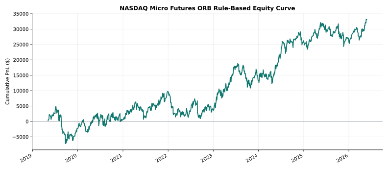
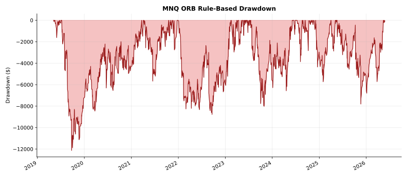
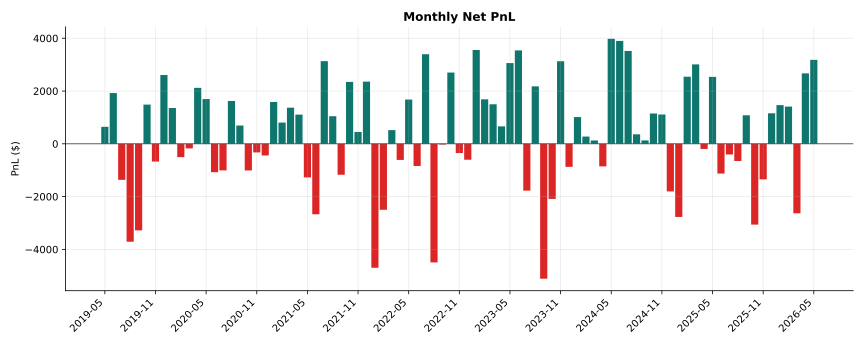
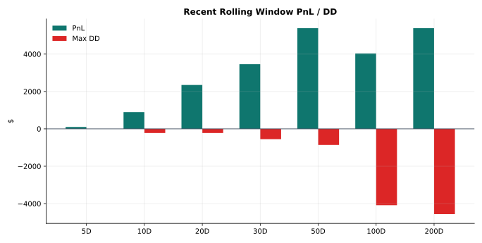
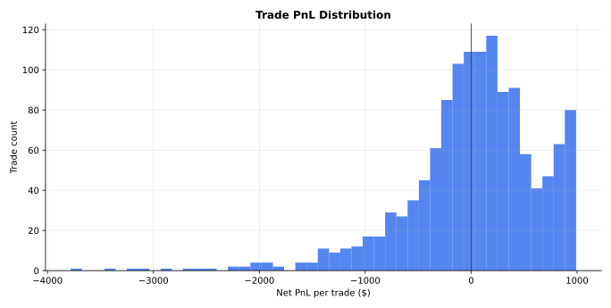

# MNQ ORB 15m Long TP2R/EOD Rule-Based Report

Strategy ID: `rule_based_15m_long_tp2r_eod`

Generated: `2026-05-31T12:00:51+00:00`

## Status

This is the current MNQ ORB rule-based research baseline. It is **not
live-ready** yet. It is the control candidate that ML overlays and future rule
variants must beat.

## Contract

| Field | Value |
| --- | --- |
| Instrument | MNQ |
| Session | New York regular session |
| Source grain | Right-labeled M1 bars |
| Opening range | 15 minutes after 09:30 NY |
| Direction | Long only |
| Signal | First M1 close above OR high |
| Entry | Next M1 open after signal close |
| Exit | TP 2R first, otherwise 15:00 NY time exit |
| Normal strategic SL | None |
| Stop reference | OR low for position sizing only |
| Target risk | $500 |
| Max trades | 1 per NY session |

## Visuals











## Performance

| Metric | Value |
| --- | ---: |
| Signal range | 2019-05-06 to 2026-05-26 |
| Trades | 1,296 |
| Win rate | 56.48% |
| Net PnL | $33,091 |
| Gross profit | $314,667 |
| Gross loss | -$281,576 |
| Profit factor | 1.12 |
| Max drawdown | -$12,124 |
| Return / DD | 2.73 |
| Expectancy / trade | $26 |
| Median trade | $93 |
| Average win | $430 |
| Average loss | -$499 |
| Payoff ratio | 0.86 |
| Average contracts | 3.48 |
| Max consecutive wins | 10 |
| Max consecutive losses | 6 |

## Cost Model

| Cost | Value |
| --- | ---: |
| Commission + fees | $1.24 RT / contract |
| Slippage | 1 tick per side |
| Modeled slippage | $1.00 RT / contract |
| Total commission paid | $5,590 |
| Total modeled slippage | $4,508 |

## Daily Quality

Sharpe and Sortino are computed from daily dollar PnL over MNQ NY session days,
with zero PnL on no-trade days, annualized by `sqrt(252)`.

| Metric | Value |
| --- | ---: |
| Trading days measured | 2,197 |
| Active days | 1,296 |
| Active-day rate | 58.99% |
| Active-day win rate | 56.48% |
| Daily average PnL | $15 |
| Daily PnL std dev | $479 |
| Daily Sharpe | 0.50 |
| Daily Sortino | 0.64 |
| Best day | $991 |
| Worst day | -$3,781 |
| Best-day profit share | 2.99% |
| 50% consistency flag | Pass |

## Rolling Windows

| Window | Trades | Win Rate | PnL | Max DD |
| ---: | ---: | ---: | ---: | ---: |
| 5D | 1 | 100.00% | $101 | $0 |
| 10D | 5 | 60.00% | $895 | -$222 |
| 20D | 10 | 70.00% | $2,348 | -$222 |
| 30D | 18 | 72.22% | $3,460 | -$551 |
| 50D | 30 | 66.67% | $5,385 | -$861 |
| 100D | 54 | 55.56% | $4,035 | -$4,085 |
| 200D | 94 | 61.70% | $5,385 | -$4,561 |

## Readout

- This is a rule-based strategy, not ML.
- The edge is positive but still shallow: PF is 1.12 and long-run Sharpe is 0.50.
- Recent 30D window is the attractive part: 18 trades, $3,460 PnL, -$551 max DD.
- The strategy has no normal SL; OR low is used for position sizing only.
- Live promotion still needs Topstep MLL simulation, first-$3000 path review,
  catastrophic guard choice, and forward-test execution plumbing.

## Source Artifacts

```text
data/Level_2_Datamart/mnq/ORB/rule_based_15m_long_tp2r_eod/events.parquet
data/Level_2_Datamart/mnq/ORB/rule_based_15m_long_tp2r_eod/summary.json
data/Level_2_Datamart/mnq/ORB/rule_based_15m_long_tp2r_eod/manifest.json
```
